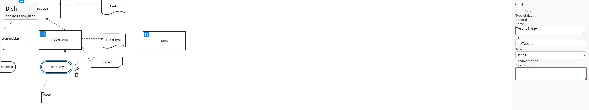

include type reference (Type) field in Properties panel for InputData.

Components changed:

[NEW] TypeRefProps:

A new property group (TypeRefProps) was added to handle the typeRef property of DMN elements.
It provides a dropdown (SelectEntry) for selecting a typeRef value from predefined data types (DEFAULT_DATA_TYPES).
The TypeRef component retrieves the current typeRef value from the business object and updates it using the modeling.updateProperties method.

The getValue function retrieves the current typeRef from the business object. The setValue function updates the typeRef using the modeling service. The getOptions function provides a list of predefined data types for the dropdown.
DmnPropertiesProvider:

The TypeRefProps is conditionally included in the GeneralGroup of the DmnPropertiesProvider if the element.businessObject.variable and its typeRef exist.
This ensures that the typeRef dropdown is displayed only for elements with businessObject.variable and a typeRef.

